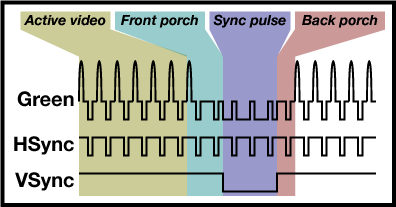

# Video
## How a VGA frame is divided

## The VGA Signals

## VGA Example AHDL
```python
{{#include ../../mystorm/examples/vga_example.py}}
```
## VGA VGA Driver and Timings AHDL
```python
{{#include ../../mystorm/tiles/vga_tile.py}}
```
[Code we ported from Lawrie](https://github.com/lawrie/blackicemx_nmigen_examples/tree/main/simple_vga) which in turn was built on 
[Guztech's VGA for ULX3s](https://github.com/GuzTech/ulx3s-nmigen-examples/tree/master/dvi)